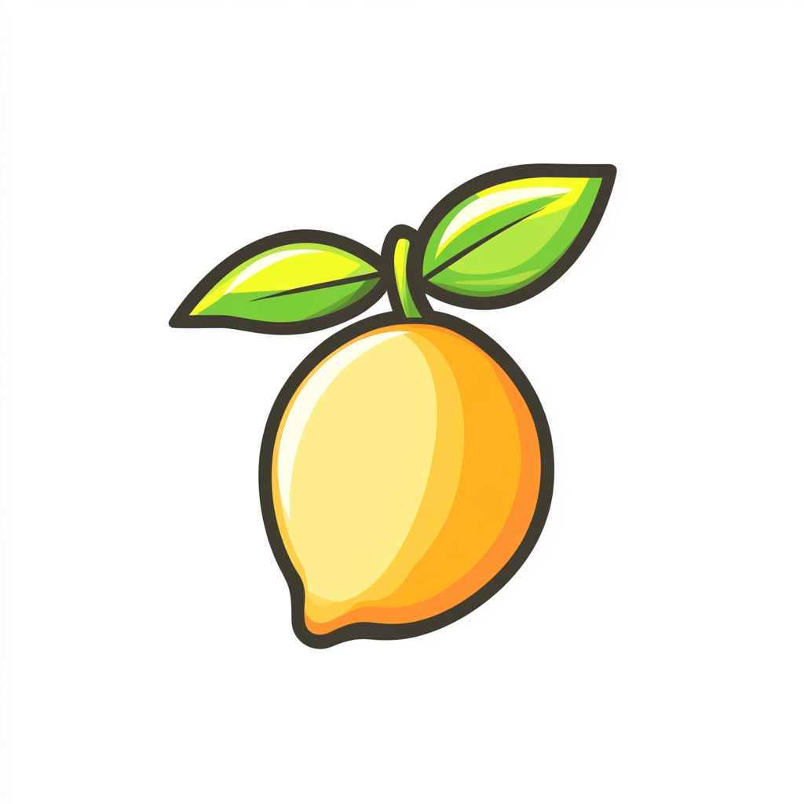

# Professional Slot Machine Game

A dynamic and interactive online slot machine game that offers a fun and engaging experience. The game allows users to place bets, spin the reels, and try their luck with various icons, each having its own payout rate and winning odds. This project utilizes localStorage to track the last 10 wins and provides a responsive and visually appealing interface.

## Table of Contents

- [Overview](#overview)
- [Features](#features)
- [Technologies Used](#technologies-used)
- [Payout Rates](#payout-rates)
- [Winning Odds](#winning-odds)
- [Concepts Covered](#concepts-covered)
- [Learning Objectives](#learning-objectives)
- [Future Improvements](#future-improvements)
- [Summary](#summary)

## Overview

The Professional Slot Machine Game is an exciting and customizable web-based slot machine where players can place bets, spin the reels, and potentially win large payouts. The game includes a variety of icons with different payout values and odds. Players can track their balance, adjust their bets, view the last 10 wins, and clear their win history. The game also features winning animations and sound effects for an immersive experience.

## Features

- **Spin the Reels**: Users can place a bet and spin the reels to try their luck.
- **Bet Adjustment**: Choose from different bet options ($0.50, $1, $2, $5, $10).
- **Winning Odds**: Each icon has a specific probability of being selected based on defined odds.
- **Payouts**: Payouts are determined by the icon displayed and the bet placed.
- **Win Tracking**: The last 10 wins are stored and displayed on the screen.
- **Clear Win History**: Players can clear their win history using a button.
- **Persistent Storage**: Win history is saved using `localStorage`, so it remains available across sessions.
- **Responsive Design**: The game adapts to various screen sizes for optimal user experience.
- **Spin Delay**: A 2-second delay is added after each spin to prevent spamming.

## Technologies Used

- **JavaScript**: For game logic, dynamic DOM manipulation, and localStorage integration.
- **HTML5/CSS3**: Provides structure and styling, including animations for spinning and winning effects.
- **localStorage**: Stores the user's win history locally for persistence across sessions.
- **CSS Animations**: Enhances the spinning reels and winning animations for an engaging user experience.
- **Responsive Design**: Ensures the game works smoothly on different screen sizes.

## Payout Rates

Each icon has a specific payout multiplier, which is applied to the bet amount when a winning combination is achieved.

| Icon                                                                          | Payout Multiplier |
| ----------------------------------------------------------------------------- | ----------------- |
|  | 2                 |
|  | 5                 |
|  | 10                |
|  | 20                |
|  | 50                |
|  | 5000              |

## Winning Odds

Each icon also has its own probability of being selected, making some icons much rarer and more rewarding than others.

| Icon                                                                          | Winning Odds |
| ----------------------------------------------------------------------------- | ------------ |
|  | 20%          |
|  | 20%          |
|  | 20%          |
|  | 15%          |
|  | 5%           |
|  | 2%           |

## Concepts Covered

- **Weighted Probability**: The game uses a custom function to simulate different probabilities for each icon during the spin.
- **JavaScript DOM Manipulation**: The slot machine dynamically updates images, balance, and win history based on the player's interaction.
- **localStorage**: Store and retrieve user data, including win history, to provide a persistent gaming experience.
- **CSS Animations**: Use animations to create a realistic spinning reel effect and celebratory winning animations.
- **Event Handling**: Handle user input through betting, spinning, and clearing win history.

## Learning Objectives

1. Learn how to integrate random weighted probability in JavaScript.
2. Understand how to manage and persist data using localStorage.
3. Explore JavaScript event handling to respond to user actions.
4. Enhance UI/UX with animations and sounds.
5. Practice responsive web design techniques to ensure the game works across devices.

## Future Improvements

- **Multi-line Slots**: Add additional paylines (horizontal, diagonal) to make the game more exciting and increase winning opportunities.
- **Progressive Jackpots**: Introduce a progressive jackpot feature for even larger potential payouts.
- **User Accounts**: Allow players to create accounts, save their game progress, and view their all-time statistics.
- **Themes**: Add multiple slot machine themes to give players a choice of visual styles.
- **Sound Customization**: Allow players to customize sound effects or music for a more personalized experience.

## Summary

The Professional Slot Machine Game is a fully interactive and engaging web application that simulates the classic slot machine experience. It offers a smooth user interface, customizable bets, realistic payouts, and winning odds for each icon. With localStorage integration and responsive design, it provides a seamless experience for players on any device. Whether you're a casual gamer or a dedicated slot enthusiast, this project delivers the thrill of a real slot machine from the comfort of your browser.
